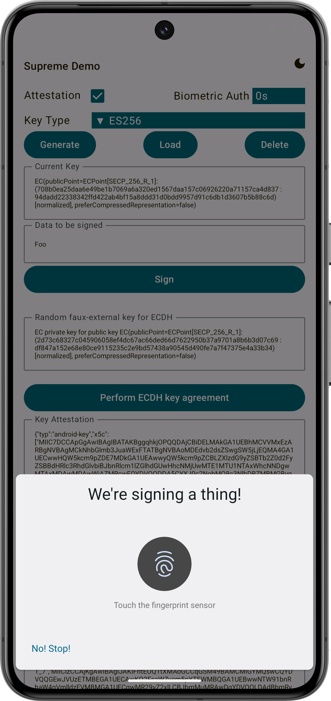

# Supreme Multiplatform (JVM, Android, iOS) Demo App

This app showcases the _Supreme_ KMP Crypto provider on JVM, Android and on iOS.
It is possible to generate key pairs, sign data, and verify the signature.

Generation of attestation statements is also supported, although on iOS, only P-256 keys can be attested due to platform constraints.
The default JVM provider does not natively support the creation of attestation statements, so it is a NOOP there.

Except for the JVM (because there is no system-wide keystore), the app relies only on multiplatform code.
Hence, everything is located in the common [App.kt](composeApp/src/commonMain/kotlin/at/asitplus/cryptotest/App.kt).  
As can be seen, no activity passing and callbacks are required, even for biometric auth! Everything _just works_&copy; automagically…

## Before running!
 - check your system with [KDoctor](https://github.com/Kotlin/kdoctor)
 - install JDK 17 on your machine
 - add `local.properties` file to the project root and set a path to Android SDK there

## Android
To run the application on android device/emulator:  
 - open project in Android Studio and run imported android run configuration

To build the application bundle:
 - run `./gradlew :composeApp:assembleDebug`
 - find `.apk` file in `composeApp/build/outputs/apk/debug/composeApp-debug.apk`

## iOS
To run the application on iPhone device/simulator:
 - Open `iosApp/iosApp.xcproject` in Xcode and run standard configuration
 - Or use [Kotlin Multiplatform Mobile plugin](https://plugins.jetbrains.com/plugin/14936-kotlin-multiplatform-mobile) for Android Studio

**Attestation and biometric auth is not supported on the simulator!** Only Apple could fix this, but this is unlikely to ever happen.

For more information on what the app does, check out its [user guide](https://a-sit-plus.github.io/signum/app)!
